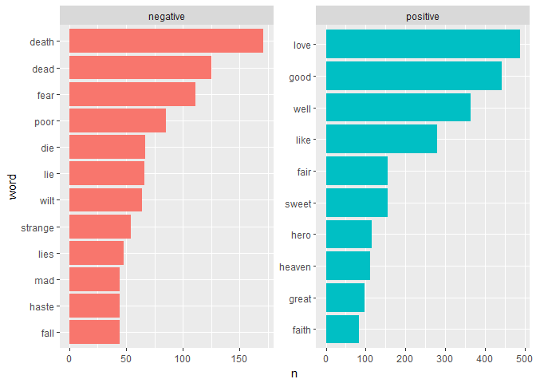
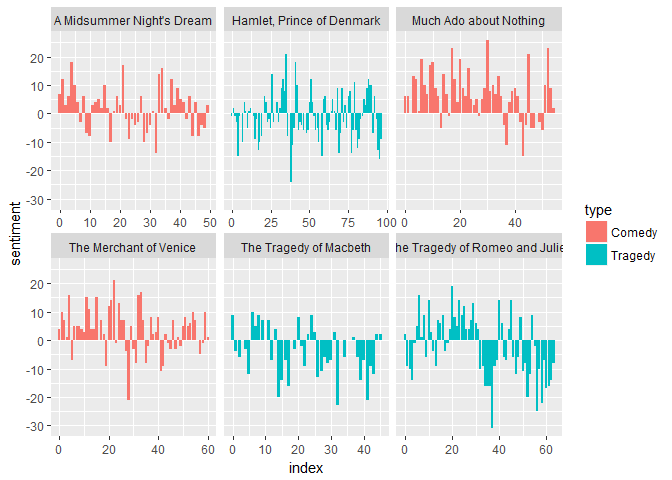

Shakespeare gets Sentimental
================
Mark Blackmore
2018-01-16

-   [To be, or not to be](#to-be-or-not-to-be)
-   [Unnesting from text to word](#unnesting-from-text-to-word)
-   [Sentiment analysis of Shakespeare](#sentiment-analysis-of-shakespeare)
-   [Tragedy or comedy?](#tragedy-or-comedy)
-   [Most common positive and negative words](#most-common-positive-and-negative-words)
-   [Word contributions by play](#word-contributions-by-play)
-   [Calculating a contribution score](#calculating-a-contribution-score)
-   [Alas, poor Yorick!](#alas-poor-yorick)
-   [Sentiment changes through a play](#sentiment-changes-through-a-play)
-   [Calculating net sentiment](#calculating-net-sentiment)
-   [Visualizing narrative arcs](#visualizing-narrative-arcs)
-   [Session info](#session-info)

``` r
suppressWarnings(
  suppressPackageStartupMessages({
    library(tidyverse)
    library(tidytext)
  })
)
```

### To be, or not to be

``` r
# Load the data
load("./data/shakespeare.rda")

# The data set shakespeare in available in the workspace
shakespeare
```

    ## # A tibble: 25,888 x 3
    ##                              title    type
    ##                              <chr>   <chr>
    ##  1 The Tragedy of Romeo and Juliet Tragedy
    ##  2 The Tragedy of Romeo and Juliet Tragedy
    ##  3 The Tragedy of Romeo and Juliet Tragedy
    ##  4 The Tragedy of Romeo and Juliet Tragedy
    ##  5 The Tragedy of Romeo and Juliet Tragedy
    ##  6 The Tragedy of Romeo and Juliet Tragedy
    ##  7 The Tragedy of Romeo and Juliet Tragedy
    ##  8 The Tragedy of Romeo and Juliet Tragedy
    ##  9 The Tragedy of Romeo and Juliet Tragedy
    ## 10 The Tragedy of Romeo and Juliet Tragedy
    ## # ... with 25,878 more rows, and 1 more variables: text <chr>

``` r
# Pipe the shakespeare data frame to the next line
shakespeare%>% 
  # Use count to find out how many titles/types there are
  count(title, type)
```

    ## # A tibble: 6 x 3
    ##                             title    type     n
    ##                             <chr>   <chr> <int>
    ## 1       A Midsummer Night's Dream  Comedy  3459
    ## 2       Hamlet, Prince of Denmark Tragedy  6776
    ## 3          Much Ado about Nothing  Comedy  3799
    ## 4          The Merchant of Venice  Comedy  4225
    ## 5          The Tragedy of Macbeth Tragedy  3188
    ## 6 The Tragedy of Romeo and Juliet Tragedy  4441

### Unnesting from text to word

``` r
tidy_shakespeare <- shakespeare %>%
  # Group by the titles of the plays
  group_by(title)%>%
  # Define a new column linenumber
  mutate(linenumber = row_number()) %>%
  # Transform the non-tidy text data to tidy text data
  unnest_tokens(word, text) %>%
  ungroup()

# Pipe the tidy Shakespeare data frame to the next line
tidy_shakespeare %>% 
  # Use count to find out how many times each word is used
  count(word, sort = TRUE)
```

    ## # A tibble: 10,736 x 2
    ##     word     n
    ##    <chr> <int>
    ##  1   the  4651
    ##  2   and  4170
    ##  3     i  3296
    ##  4    to  3047
    ##  5    of  2645
    ##  6     a  2511
    ##  7   you  2287
    ##  8    my  1913
    ##  9    in  1836
    ## 10  that  1721
    ## # ... with 10,726 more rows

### Sentiment analysis of Shakespeare

``` r
shakespeare_sentiment <- tidy_shakespeare %>%
  # Implement sentiment analysis with the "bing" lexicon
  inner_join(get_sentiments("bing")) 
```

    ## Joining, by = "word"

``` r
shakespeare_sentiment %>%
  # Find how many positive/negative words each play has
  count(title, sentiment)
```

    ## # A tibble: 12 x 3
    ##                              title sentiment     n
    ##                              <chr>     <chr> <int>
    ##  1       A Midsummer Night's Dream  negative   681
    ##  2       A Midsummer Night's Dream  positive   773
    ##  3       Hamlet, Prince of Denmark  negative  1323
    ##  4       Hamlet, Prince of Denmark  positive  1223
    ##  5          Much Ado about Nothing  negative   767
    ##  6          Much Ado about Nothing  positive  1127
    ##  7          The Merchant of Venice  negative   740
    ##  8          The Merchant of Venice  positive   962
    ##  9          The Tragedy of Macbeth  negative   914
    ## 10          The Tragedy of Macbeth  positive   749
    ## 11 The Tragedy of Romeo and Juliet  negative  1235
    ## 12 The Tragedy of Romeo and Juliet  positive  1090

### Tragedy or comedy?

``` r
sentiment_counts <- tidy_shakespeare %>%
  # Implement sentiment analysis using the "bing" lexicon
  inner_join(get_sentiments("bing")) %>%
  # Count the number of words by title, type, and sentiment
  count(title, type, sentiment)
```

    ## Joining, by = "word"

``` r
sentiment_counts %>%
  # Group by the titles of the plays
  group_by(title) %>%
  # Find the total number of words in each play
  mutate(total = sum(n),
         # Calculate the number of words divided by the total
         percent = n / total) %>%
  # Filter the results for only negative sentiment
  filter(sentiment == "negative") %>%
  arrange(percent)
```

    ## # A tibble: 6 x 6
    ## # Groups:   title [6]
    ##                             title    type sentiment     n total   percent
    ##                             <chr>   <chr>     <chr> <int> <int>     <dbl>
    ## 1          Much Ado about Nothing  Comedy  negative   767  1894 0.4049630
    ## 2          The Merchant of Venice  Comedy  negative   740  1702 0.4347826
    ## 3       A Midsummer Night's Dream  Comedy  negative   681  1454 0.4683631
    ## 4       Hamlet, Prince of Denmark Tragedy  negative  1323  2546 0.5196386
    ## 5 The Tragedy of Romeo and Juliet Tragedy  negative  1235  2325 0.5311828
    ## 6          The Tragedy of Macbeth Tragedy  negative   914  1663 0.5496091

### Most common positive and negative words

``` r
word_counts <- tidy_shakespeare %>%
  # Implement sentiment analysis using the "bing" lexicon
  inner_join(get_sentiments("bing")) %>%
  # Count by word and sentiment
  count(word, sentiment)
```

    ## Joining, by = "word"

``` r
top_words <- word_counts %>%
  # Group by sentiment
  group_by(sentiment) %>%
  # Take the top 10 for each sentiment
  top_n(10) %>%
  ungroup() %>%
  # Make word a factor in order of n
  mutate(word = reorder(word, n))
```

    ## Selecting by n

``` r
# Use aes() to put words on the x-axis and n on the y-axis
ggplot(top_words, aes(word, n, fill = sentiment)) +
  # Make a bar chart with geom_col()
  geom_col(show.legend = FALSE) +
  facet_wrap(~sentiment, scales = "free") +  
  coord_flip()
```



### Word contributions by play

``` r
tidy_shakespeare %>%
  # Count by title and word
  count(title, word, sort = TRUE) %>%
  # Implement sentiment analysis using the "afinn" lexicon
  inner_join(get_sentiments("afinn")) %>%
  # Filter to only examine the scores for Macbeth that are negative
  filter(title == "The Tragedy of Macbeth", score < 0)
```

    ## Joining, by = "word"

    ## # A tibble: 237 x 4
    ##                     title    word     n score
    ##                     <chr>   <chr> <int> <int>
    ##  1 The Tragedy of Macbeth      no    73    -1
    ##  2 The Tragedy of Macbeth    fear    35    -2
    ##  3 The Tragedy of Macbeth   death    20    -2
    ##  4 The Tragedy of Macbeth  bloody    16    -3
    ##  5 The Tragedy of Macbeth    poor    16    -2
    ##  6 The Tragedy of Macbeth strange    16    -1
    ##  7 The Tragedy of Macbeth    dead    14    -3
    ##  8 The Tragedy of Macbeth   leave    14    -1
    ##  9 The Tragedy of Macbeth   fight    13    -1
    ## 10 The Tragedy of Macbeth charges    11    -2
    ## # ... with 227 more rows

### Calculating a contribution score

``` r
sentiment_contributions <- tidy_shakespeare %>%
  # Count by title and word
  count(title, word, sort = TRUE) %>%
  # Implement sentiment analysis using the "afinn" lexicon
  inner_join(get_sentiments("afinn")) %>%
  # Group by title
  group_by(title) %>%
  # Calculate a contribution for each word in each title
  mutate(contribution = score * n / sum(n)) %>%
  ungroup()
```

    ## Joining, by = "word"

``` r
sentiment_contributions
```

    ## # A tibble: 2,366 x 5
    ##                              title  word     n score contribution
    ##                              <chr> <chr> <int> <int>        <dbl>
    ##  1       Hamlet, Prince of Denmark    no   143    -1  -0.06520748
    ##  2 The Tragedy of Romeo and Juliet  love   140     3   0.21319797
    ##  3          Much Ado about Nothing    no   132    -1  -0.07683353
    ##  4          Much Ado about Nothing  hero   114     2   0.13271246
    ##  5       A Midsummer Night's Dream  love   110     3   0.26982829
    ##  6       Hamlet, Prince of Denmark  good   109     3   0.14911081
    ##  7 The Tragedy of Romeo and Juliet    no   102    -1  -0.05177665
    ##  8          Much Ado about Nothing  good    93     3   0.16239814
    ##  9          The Merchant of Venice    no    92    -1  -0.06301370
    ## 10          Much Ado about Nothing  love    91     3   0.15890570
    ## # ... with 2,356 more rows

### Alas, poor Yorick!

``` r
sentiment_contributions %>%
  # Filter for Hamlet
  filter(title == "Hamlet, Prince of Denmark") %>%
  # Arrange to see the most negative words
  arrange(contribution)
```

    ## # A tibble: 493 x 5
    ##                        title    word     n score contribution
    ##                        <chr>   <chr> <int> <int>        <dbl>
    ##  1 Hamlet, Prince of Denmark      no   143    -1  -0.06520748
    ##  2 Hamlet, Prince of Denmark    dead    33    -3  -0.04514364
    ##  3 Hamlet, Prince of Denmark   death    38    -2  -0.03465572
    ##  4 Hamlet, Prince of Denmark madness    22    -3  -0.03009576
    ##  5 Hamlet, Prince of Denmark     mad    21    -3  -0.02872777
    ##  6 Hamlet, Prince of Denmark    fear    21    -2  -0.01915185
    ##  7 Hamlet, Prince of Denmark    poor    20    -2  -0.01823985
    ##  8 Hamlet, Prince of Denmark    hell    10    -4  -0.01823985
    ##  9 Hamlet, Prince of Denmark   grave    17    -2  -0.01550388
    ## 10 Hamlet, Prince of Denmark   ghost    32    -1  -0.01459188
    ## # ... with 483 more rows

``` r
sentiment_contributions %>%
  # Filter for The Merchant of Venice
  filter(title == "The Merchant of Venice") %>%
  # Arrange to see the most positive words
  arrange(desc(contribution))
```

    ## # A tibble: 344 x 5
    ##                     title    word     n score contribution
    ##                     <chr>   <chr> <int> <int>        <dbl>
    ##  1 The Merchant of Venice    good    63     3   0.12945205
    ##  2 The Merchant of Venice    love    60     3   0.12328767
    ##  3 The Merchant of Venice    fair    35     2   0.04794521
    ##  4 The Merchant of Venice    like    34     2   0.04657534
    ##  5 The Merchant of Venice    true    24     2   0.03287671
    ##  6 The Merchant of Venice   sweet    23     2   0.03150685
    ##  7 The Merchant of Venice    pray    42     1   0.02876712
    ##  8 The Merchant of Venice  better    21     2   0.02876712
    ##  9 The Merchant of Venice justice    17     2   0.02328767
    ## 10 The Merchant of Venice welcome    17     2   0.02328767
    ## # ... with 334 more rows

### Sentiment changes through a play

``` r
tidy_shakespeare %>%
  # Implement sentiment analysis using "bing" lexicon
  inner_join(get_sentiments("bing")) %>%
  # Count using four arguments
  count(title, type, index = linenumber %/% 70, sentiment)
```

    ## Joining, by = "word"

    ## # A tibble: 744 x 5
    ##                        title   type index sentiment     n
    ##                        <chr>  <chr> <dbl>     <chr> <int>
    ##  1 A Midsummer Night's Dream Comedy     0  negative     4
    ##  2 A Midsummer Night's Dream Comedy     0  positive    11
    ##  3 A Midsummer Night's Dream Comedy     1  negative     7
    ##  4 A Midsummer Night's Dream Comedy     1  positive    19
    ##  5 A Midsummer Night's Dream Comedy     2  negative    20
    ##  6 A Midsummer Night's Dream Comedy     2  positive    23
    ##  7 A Midsummer Night's Dream Comedy     3  negative    12
    ##  8 A Midsummer Night's Dream Comedy     3  positive    18
    ##  9 A Midsummer Night's Dream Comedy     4  negative     9
    ## 10 A Midsummer Night's Dream Comedy     4  positive    27
    ## # ... with 734 more rows

### Calculating net sentiment

``` r
tidy_shakespeare %>%
  inner_join(get_sentiments("bing")) %>%
  count(title, type, index = linenumber %/% 70, sentiment) %>%
  # Spread sentiment and n across multiple columns
  spread(sentiment, n, fill = 0) %>%
  # Use mutate to find net sentiment
  mutate(sentiment = positive - negative)
```

    ## Joining, by = "word"

    ## # A tibble: 373 x 6
    ##                        title   type index negative positive sentiment
    ##                        <chr>  <chr> <dbl>    <dbl>    <dbl>     <dbl>
    ##  1 A Midsummer Night's Dream Comedy     0        4       11         7
    ##  2 A Midsummer Night's Dream Comedy     1        7       19        12
    ##  3 A Midsummer Night's Dream Comedy     2       20       23         3
    ##  4 A Midsummer Night's Dream Comedy     3       12       18         6
    ##  5 A Midsummer Night's Dream Comedy     4        9       27        18
    ##  6 A Midsummer Night's Dream Comedy     5       11       21        10
    ##  7 A Midsummer Night's Dream Comedy     6       12       16         4
    ##  8 A Midsummer Night's Dream Comedy     7        9        6        -3
    ##  9 A Midsummer Night's Dream Comedy     8        6       12         6
    ## 10 A Midsummer Night's Dream Comedy     9       19       12        -7
    ## # ... with 363 more rows

### Visualizing narrative arcs

``` r
tidy_shakespeare %>%
  inner_join(get_sentiments("bing")) %>%
  count(title, type, index = linenumber %/% 70, sentiment) %>%
  spread(sentiment, n, fill = 0) %>%
  mutate(sentiment = positive - negative) %>%
  # Put index on x-axis, sentiment on y-axis, and map comedy/tragedy to fill
  ggplot(aes(index, sentiment, fill = type)) +
  # Make a bar chart with geom_col()
  geom_col() +
  # Separate panels with facet_wrap()
  facet_wrap(~ title, scales = "free_x")
```

    ## Joining, by = "word"



------------------------------------------------------------------------

Session info
------------

``` r
sessionInfo()
```

    ## R version 3.4.2 (2017-09-28)
    ## Platform: x86_64-w64-mingw32/x64 (64-bit)
    ## Running under: Windows 10 x64 (build 16299)
    ## 
    ## Matrix products: default
    ## 
    ## locale:
    ## [1] LC_COLLATE=English_United States.1252 
    ## [2] LC_CTYPE=English_United States.1252   
    ## [3] LC_MONETARY=English_United States.1252
    ## [4] LC_NUMERIC=C                          
    ## [5] LC_TIME=English_United States.1252    
    ## 
    ## attached base packages:
    ## [1] stats     graphics  grDevices utils     datasets  methods   base     
    ## 
    ## other attached packages:
    ## [1] bindrcpp_0.2    tidytext_0.1.4  dplyr_0.7.4     purrr_0.2.3    
    ## [5] readr_1.1.1     tidyr_0.7.1     tibble_1.3.4    ggplot2_2.2.1  
    ## [9] tidyverse_1.1.1
    ## 
    ## loaded via a namespace (and not attached):
    ##  [1] tidyselect_0.2.2  reshape2_1.4.2    haven_1.1.0      
    ##  [4] lattice_0.20-35   colorspace_1.3-2  htmltools_0.3.6  
    ##  [7] SnowballC_0.5.1   yaml_2.1.14       rlang_0.1.2      
    ## [10] foreign_0.8-69    glue_1.1.1        modelr_0.1.1     
    ## [13] readxl_1.0.0      bindr_0.1         plyr_1.8.4       
    ## [16] stringr_1.2.0     munsell_0.4.3     gtable_0.2.0     
    ## [19] cellranger_1.1.0  rvest_0.3.2       psych_1.7.8      
    ## [22] evaluate_0.10.1   labeling_0.3      knitr_1.17       
    ## [25] forcats_0.2.0     parallel_3.4.2    broom_0.4.2      
    ## [28] tokenizers_0.1.4  Rcpp_0.12.13      scales_0.5.0     
    ## [31] backports_1.1.1   jsonlite_1.5      mnormt_1.5-5     
    ## [34] hms_0.3           digest_0.6.12     stringi_1.1.5    
    ## [37] grid_3.4.2        rprojroot_1.2     tools_3.4.2      
    ## [40] magrittr_1.5      lazyeval_0.2.0    janeaustenr_0.1.5
    ## [43] pkgconfig_2.0.1   Matrix_1.2-11     xml2_1.1.1       
    ## [46] lubridate_1.6.0   assertthat_0.2.0  rmarkdown_1.6    
    ## [49] httr_1.3.1        R6_2.2.2          nlme_3.1-131     
    ## [52] compiler_3.4.2
