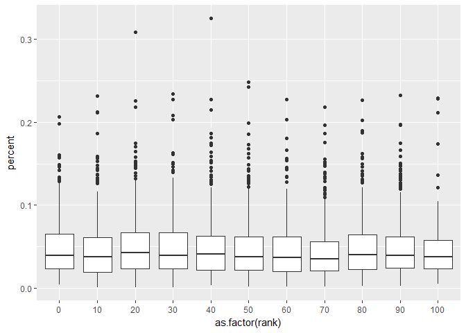
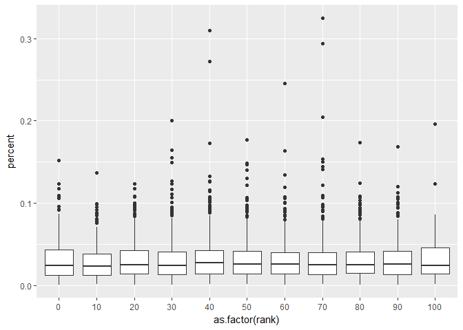
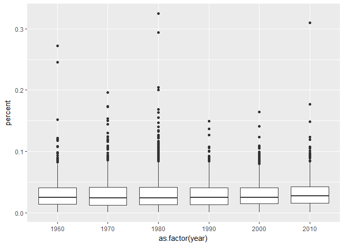
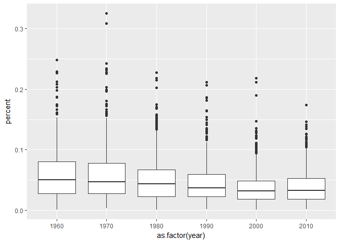

Singing a Happy Song (or Sad?!)
================
Mark Blackmore
2018-01-24

-   [Tidying song lyrics](#tidying-song-lyrics)
-   [Calculating total words per song](#calculating-total-words-per-song)
-   [Sentiment analysis on song lyrics](#sentiment-analysis-on-song-lyrics)
-   [The most positive and negative songs](#the-most-positive-and-negative-songs)
-   [Sentiment and Billboard rank](#sentiment-and-billboard-rank)
-   [More on Billboard rank and sentiment scores](#more-on-billboard-rank-and-sentiment-scores)
-   [Sentiment scores by year](#sentiment-scores-by-year)
-   [Modeling negative sentiment](#modeling-negative-sentiment)
-   [Modeling positive sentiment](#modeling-positive-sentiment)
-   [Session info](#session-info)

``` r
suppressWarnings(
  suppressPackageStartupMessages({
    library(tidyverse)
    library(tidytext)
  })
)
```

### Tidying song lyrics

``` r
load("./data/song_lyrics.rda")

# Pipe song_lyrics to the next line
tidy_lyrics <- song_lyrics %>% 
  # Transform the lyrics column to a word column
  unnest_tokens(word, lyrics)

# Print tidy_lyrics
tidy_lyrics  
```

    ## # A tibble: 1,602,879 x 5
    ##     rank        song                        artist  year          word
    ##    <int>       <chr>                         <chr> <int>         <chr>
    ##  1     1 wooly bully sam the sham and the pharaohs  1965           sam
    ##  2     1 wooly bully sam the sham and the pharaohs  1965           the
    ##  3     1 wooly bully sam the sham and the pharaohs  1965          sham
    ##  4     1 wooly bully sam the sham and the pharaohs  1965 miscellaneous
    ##  5     1 wooly bully sam the sham and the pharaohs  1965         wooly
    ##  6     1 wooly bully sam the sham and the pharaohs  1965         bully
    ##  7     1 wooly bully sam the sham and the pharaohs  1965         wooly
    ##  8     1 wooly bully sam the sham and the pharaohs  1965         bully
    ##  9     1 wooly bully sam the sham and the pharaohs  1965           sam
    ## 10     1 wooly bully sam the sham and the pharaohs  1965           the
    ## # ... with 1,602,869 more rows

### Calculating total words per song

``` r
totals <- tidy_lyrics %>%
  # Count by song to find the word totals for each song
  count(song) %>%
  # Rename the new column
  rename(total_words = n)

# Print totals    
totals
```

    ## # A tibble: 4,341 x 2
    ##                      song total_words
    ##                     <chr>       <int>
    ##  1 0 to 100  the catch up         894
    ##  2     1 2 3 4 sumpin new         670
    ##  3        1 2 3 red light         145
    ##  4               1 2 step         437
    ##  5                1 thing         532
    ##  6          100 pure love         590
    ##  7              100 years         257
    ##  8                    123         220
    ##  9            18 and life         285
    ## 10            19 somethin         281
    ## # ... with 4,331 more rows

``` r
lyric_counts <- tidy_lyrics %>%
  # Combine totals with tidy_lyrics using the "song" column
  left_join(totals, by = "song")
```

### Sentiment analysis on song lyrics

``` r
lyric_sentiment <- lyric_counts %>%
  # Implement sentiment analysis with the "nrc" lexicon
  inner_join(get_sentiments("nrc"))
```

    ## Joining, by = "word"

``` r
lyric_sentiment %>%
  # Find how many sentiment words each song has
  count(song, sentiment , sort = TRUE)
```

    ## # A tibble: 39,564 x 3
    ##              song sentiment     n
    ##             <chr>     <chr> <int>
    ##  1           baby  positive   264
    ##  2           baby       joy   255
    ##  3      real love  positive   213
    ##  4          angel  positive   193
    ##  5      disturbia  negative   182
    ##  6 live your life  positive   174
    ##  7        my love  positive   173
    ##  8          angel       joy   164
    ##  9           damn  negative   164
    ## 10      disturbia   sadness   164
    ## # ... with 39,554 more rows

### The most positive and negative songs

``` r
# What songs have the highest proportion of negative words?
lyric_sentiment %>%
  # Count using three arguments
  count(song, sentiment, total_words) %>%
  ungroup() %>%
  # Make a new percent column with mutate 
  mutate(percent = n / total_words) %>%
  # Filter for only negative words
  filter(sentiment == "negative") %>%
  # Arrange by descending percent
  arrange(desc(percent))
```

    ## # A tibble: 4,169 x 5
    ##                              song sentiment total_words     n   percent
    ##                             <chr>     <chr>       <int> <int>     <dbl>
    ##  1                        bad boy  negative         237    77 0.3248945
    ##  2                      rack city  negative         458   142 0.3100437
    ##  3                ill tumble 4 ya  negative         269    79 0.2936803
    ##  4               time wont let me  negative         154    42 0.2727273
    ##  5 bang bang my baby shot me down  negative         163    40 0.2453988
    ##  6                     the stroke  negative         279    57 0.2043011
    ##  7                  the wild boys  negative         245    49 0.2000000
    ##  8                 pop that thang  negative         204    40 0.1960784
    ##  9                      disturbia  negative         956   182 0.1903766
    ## 10                        dance a  negative         407    72 0.1769042
    ## # ... with 4,159 more rows

``` r
# What songs have the highest proportion of positive words?
lyric_sentiment %>%
  # Count using three arguments
  count(song, sentiment, total_words) %>%
  ungroup() %>%
  # Make a new percent column with mutate 
  mutate(percent = n / total_words) %>%
  # Filter for only negative words
  filter(sentiment == "positive") %>%
  # Arrange by descending percent
  arrange(desc(percent))
```

    ## # A tibble: 4,295 x 5
    ##                                      song sentiment total_words     n
    ##                                     <chr>     <chr>       <int> <int>
    ##  1                  love to love you baby  positive         240    78
    ##  2 dance dance dance yowsah yowsah yowsah  positive         305    94
    ##  3                       i got the feelin  positive         141    35
    ##  4                           i love music  positive         252    61
    ##  5                     sweet and innocent  positive         218    51
    ##  6                    me and baby brother  positive         181    42
    ##  7                          love hangover  positive         173    40
    ##  8                     sweet cream ladies  positive         179    41
    ##  9                            mighty love  positive         482   110
    ## 10               keep feeling fascination  positive         189    43
    ## # ... with 4,285 more rows, and 1 more variables: percent <dbl>

### Sentiment and Billboard rank

``` r
lyric_sentiment %>%
  filter(sentiment == "positive") %>%
  # Count by song, Billboard rank, and the total number of words
  count(song, rank, total_words) %>%
  ungroup() %>%
  # Use the correct dplyr verb to make two new columns
  mutate(percent = n / total_words,
         rank = 10 * floor(rank / 10)) %>%
  ggplot(aes(as.factor(rank), percent)) +
  # Make a boxplot
  geom_boxplot()
```



### More on Billboard rank and sentiment scores

``` r
lyric_sentiment %>%
  # Filter for only negative words
  filter(sentiment == "negative") %>%
  # Count by song, Billboard rank, and the total number of words
  count(song,rank, total_words)%>%
  ungroup() %>%
  # Mutate to make a percent column
  mutate(percent = n / total_words,
         rank = 10 * floor(rank / 10)) %>%
  # Use ggplot to set up a plot with rank and percent
  ggplot(aes(as.factor(rank), percent)) +
  # Make a boxplot
  geom_boxplot()
```



### Sentiment scores by year

``` r
# How is negative sentiment changing over time?
lyric_sentiment %>%
  # Filter for only negative words
  filter(sentiment == "negative") %>%
  # Count by song, year, and the total number of words
  count(song, year, total_words) %>%
  ungroup() %>%
  mutate(percent = n / total_words,
         year = 10 * floor(year / 10)) %>%
  # Use ggplot to set up a plot with year and percent
  ggplot(aes(as.factor(year), percent)) +
  geom_boxplot()
```



``` r
# How is positive sentiment changing over time?
lyric_sentiment %>%
  filter(sentiment == "positive") %>%
  count(song, year, total_words) %>%
  ungroup() %>%
  mutate(percent = n / total_words,
         year = 10 * floor(year / 10)) %>%
  ggplot(aes(as.factor(year), percent)) +
  geom_boxplot()
```



### Modeling negative sentiment

``` r
negative_by_year <- lyric_sentiment %>%
  # Filter for negative words
  filter(sentiment == "negative") %>%
  count(song, year, total_words) %>%
  ungroup() %>%
  # Define a new column: percent
  mutate(percent = n / total_words)

# Specify the model with percent as the response and year as the predictor
model_negative <- lm(percent ~ year, data = negative_by_year)

# Use summary to see the results of the model fitting
summary(model_negative)
```

    ## 
    ## Call:
    ## lm(formula = percent ~ year, data = negative_by_year)
    ## 
    ## Residuals:
    ##       Min        1Q    Median        3Q       Max 
    ## -0.030288 -0.017205 -0.005778  0.010505  0.294194 
    ## 
    ## Coefficients:
    ##               Estimate Std. Error t value Pr(>|t|)
    ## (Intercept)  3.809e-02  5.022e-02   0.758    0.448
    ## year        -3.720e-06  2.523e-05  -0.147    0.883
    ## 
    ## Residual standard error: 0.02513 on 4624 degrees of freedom
    ## Multiple R-squared:  4.702e-06,  Adjusted R-squared:  -0.0002116 
    ## F-statistic: 0.02174 on 1 and 4624 DF,  p-value: 0.8828

### Modeling positive sentiment

``` r
positive_by_year <- lyric_sentiment %>%
  filter(sentiment == "positive") %>%
  # Count by song, year, and total number of words
  count(song, year, total_words) %>%
  ungroup() %>%
  # Define a new column: percent
  mutate(percent = n / total_words)

# Fit a linear model with percent as the response and year as the predictor
model_positive <- lm(percent ~ year, data = positive_by_year)

# Use summary to see the results of the model fitting
summary(model_positive)
```

    ## 
    ## Call:
    ## lm(formula = percent ~ year, data = positive_by_year)
    ## 
    ## Residuals:
    ##       Min        1Q    Median        3Q       Max 
    ## -0.058050 -0.024032 -0.007756  0.014774  0.269726 
    ## 
    ## Coefficients:
    ##               Estimate Std. Error t value Pr(>|t|)    
    ## (Intercept)  1.117e+00  6.859e-02   16.29   <2e-16 ***
    ## year        -5.373e-04  3.446e-05  -15.59   <2e-16 ***
    ## ---
    ## Signif. codes:  0 '***' 0.001 '**' 0.01 '*' 0.05 '.' 0.1 ' ' 1
    ## 
    ## Residual standard error: 0.03495 on 4770 degrees of freedom
    ## Multiple R-squared:  0.0485, Adjusted R-squared:  0.0483 
    ## F-statistic: 243.1 on 1 and 4770 DF,  p-value: < 2.2e-16

------------------------------------------------------------------------

Session info
------------

``` r
sessionInfo()
```

    ## R version 3.4.2 (2017-09-28)
    ## Platform: x86_64-w64-mingw32/x64 (64-bit)
    ## Running under: Windows 10 x64 (build 16299)
    ## 
    ## Matrix products: default
    ## 
    ## locale:
    ## [1] LC_COLLATE=English_United States.1252 
    ## [2] LC_CTYPE=English_United States.1252   
    ## [3] LC_MONETARY=English_United States.1252
    ## [4] LC_NUMERIC=C                          
    ## [5] LC_TIME=English_United States.1252    
    ## 
    ## attached base packages:
    ## [1] stats     graphics  grDevices utils     datasets  methods   base     
    ## 
    ## other attached packages:
    ## [1] bindrcpp_0.2    tidytext_0.1.4  dplyr_0.7.4     purrr_0.2.3    
    ## [5] readr_1.1.1     tidyr_0.7.1     tibble_1.3.4    ggplot2_2.2.1  
    ## [9] tidyverse_1.1.1
    ## 
    ## loaded via a namespace (and not attached):
    ##  [1] Rcpp_0.12.13      cellranger_1.1.0  compiler_3.4.2   
    ##  [4] plyr_1.8.4        bindr_0.1         tokenizers_0.1.4 
    ##  [7] forcats_0.2.0     tools_3.4.2       digest_0.6.12    
    ## [10] lubridate_1.6.0   jsonlite_1.5      evaluate_0.10.1  
    ## [13] nlme_3.1-131      gtable_0.2.0      lattice_0.20-35  
    ## [16] pkgconfig_2.0.1   rlang_0.1.2       Matrix_1.2-11    
    ## [19] psych_1.7.8       yaml_2.1.14       parallel_3.4.2   
    ## [22] haven_1.1.0       janeaustenr_0.1.5 xml2_1.1.1       
    ## [25] httr_1.3.1        stringr_1.2.0     knitr_1.17       
    ## [28] hms_0.3           rprojroot_1.2     grid_3.4.2       
    ## [31] glue_1.1.1        R6_2.2.2          readxl_1.0.0     
    ## [34] foreign_0.8-69    rmarkdown_1.6     modelr_0.1.1     
    ## [37] reshape2_1.4.2    magrittr_1.5      SnowballC_0.5.1  
    ## [40] backports_1.1.1   scales_0.5.0      htmltools_0.3.6  
    ## [43] rvest_0.3.2       assertthat_0.2.0  mnormt_1.5-5     
    ## [46] colorspace_1.3-2  labeling_0.3      stringi_1.1.5    
    ## [49] lazyeval_0.2.0    munsell_0.4.3     broom_0.4.2
