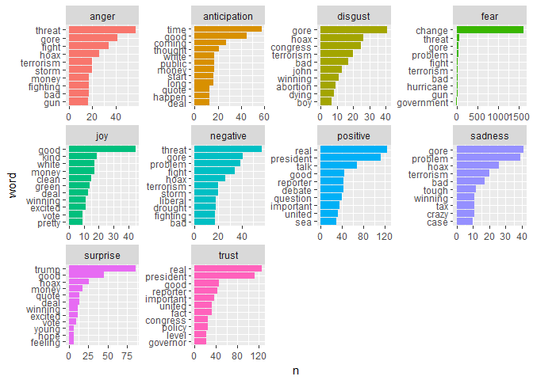
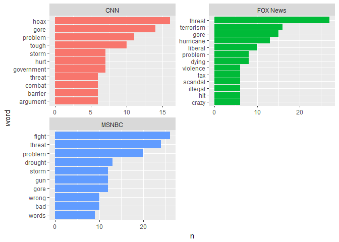
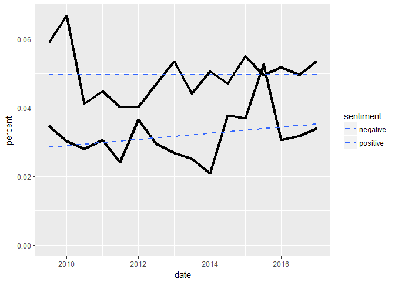
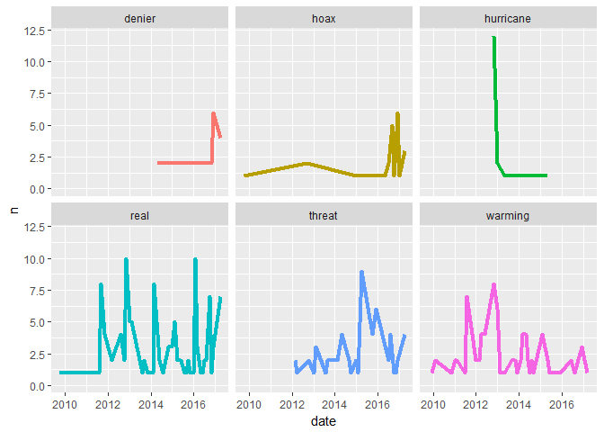

Analyzing TV News
================
Mark Blackmore
2018-01-18

-   [Tidying TV news](#tidying-tv-news)
-   [Counting totals](#counting-totals)
-   [Sentiment analysis of tv news](#sentiment-analysis-of-tv-news)
-   [Which station uses the most positive or negative words?](#which-station-uses-the-most-positive-or-negative-words)
-   [Which words contribute to the sentiment scores?](#which-words-contribute-to-the-sentiment-scores)
-   [Word choice and TV station](#word-choice-and-tv-station)
-   [Visualizing sentiment over time](#visualizing-sentiment-over-time)
-   [Word changes over time](#word-changes-over-time)
-   [Session info](#session-info)

``` r
suppressWarnings(
  suppressPackageStartupMessages({
    library(tidyverse)
    library(tidytext)
  })
)
```

### Tidying TV news

``` r
load("./data/climate_text.rda")

climate_text
```

    ## # A tibble: 593 x 4
    ##    station                                 show           show_date
    ##      <chr>                                <chr>              <dttm>
    ##  1   MSNBC                      Morning Meeting 2009-09-22 13:00:00
    ##  2   MSNBC                      Morning Meeting 2009-10-23 13:00:00
    ##  3     CNN                         CNN Newsroom 2009-12-03 20:00:00
    ##  4     CNN                     American Morning 2009-12-07 11:00:00
    ##  5   MSNBC                      Morning Meeting 2009-12-08 14:00:00
    ##  6   MSNBC       Countdown With Keith Olbermann 2009-12-10 06:00:00
    ##  7     CNN                      Sanjay Gupta MD 2009-12-12 12:30:00
    ##  8     CNN The Situation Room With Wolf Blitzer 2009-12-16 21:00:00
    ##  9   MSNBC       Countdown With Keith Olbermann 2009-12-19 01:00:00
    ## 10   MSNBC               The Rachel Maddow Show 2010-01-08 04:00:00
    ## # ... with 583 more rows, and 1 more variables: text <chr>

``` r
# Pipe the climate_text dataset to the next line
tidy_tv <- climate_text %>%
  # Transform the non-tidy text data to tidy text data
  unnest_tokens(word, text)

tidy_tv
```

    ## # A tibble: 41,076 x 4
    ##    station            show           show_date       word
    ##      <chr>           <chr>              <dttm>      <chr>
    ##  1   MSNBC Morning Meeting 2009-09-22 13:00:00        the
    ##  2   MSNBC Morning Meeting 2009-09-22 13:00:00   interior
    ##  3   MSNBC Morning Meeting 2009-09-22 13:00:00 positively
    ##  4   MSNBC Morning Meeting 2009-09-22 13:00:00      oozes
    ##  5   MSNBC Morning Meeting 2009-09-22 13:00:00      class
    ##  6   MSNBC Morning Meeting 2009-09-22 13:00:00      raves
    ##  7   MSNBC Morning Meeting 2009-09-22 13:00:00        car
    ##  8   MSNBC Morning Meeting 2009-09-22 13:00:00   magazine
    ##  9   MSNBC Morning Meeting 2009-09-22 13:00:00      slick
    ## 10   MSNBC Morning Meeting 2009-09-22 13:00:00        and
    ## # ... with 41,066 more rows

### Counting totals

``` r
tidy_tv %>% 
  anti_join(stop_words) %>%
  # Count by word with sort = TRUE
  count(word, sort = TRUE)
```

    ## Joining, by = "word"

    ## # A tibble: 3,699 x 2
    ##         word     n
    ##        <chr> <int>
    ##  1   climate  1627
    ##  2    change  1615
    ##  3    people   139
    ##  4      real   125
    ##  5 president   112
    ##  6    global   107
    ##  7     issue    87
    ##  8     trump    86
    ##  9   warming    85
    ## 10    issues    69
    ## # ... with 3,689 more rows

``` r
tidy_tv %>%
  # Count by station
  count(station) %>%
  # Rename the new column station_total
  rename(station_total = n)
```

    ## # A tibble: 3 x 2
    ##    station station_total
    ##      <chr>         <int>
    ## 1      CNN         10713
    ## 2 FOX News         10876
    ## 3    MSNBC         19487

### Sentiment analysis of tv news

``` r
tv_sentiment <- tidy_tv %>% 
  # Group by station
  group_by(station) %>% 
  # Define a new column station_total
  mutate(station_total = n()) %>%
  ungroup() %>%
  # Implement sentiment analysis with the NRC lexicon
  inner_join(get_sentiments("nrc"))
```

    ## Joining, by = "word"

``` r
tv_sentiment
```

    ## # A tibble: 10,175 x 6
    ##    station            show           show_date      word station_total
    ##      <chr>           <chr>              <dttm>     <chr>         <int>
    ##  1   MSNBC Morning Meeting 2009-09-22 13:00:00  interior         19487
    ##  2   MSNBC Morning Meeting 2009-09-22 13:00:00  interior         19487
    ##  3   MSNBC Morning Meeting 2009-09-22 13:00:00  interior         19487
    ##  4   MSNBC Morning Meeting 2009-09-22 13:00:00  sensuous         19487
    ##  5   MSNBC Morning Meeting 2009-09-22 13:00:00  sensuous         19487
    ##  6   MSNBC Morning Meeting 2009-09-22 13:00:00  striking         19487
    ##  7   MSNBC Morning Meeting 2009-09-22 13:00:00      join         19487
    ##  8   MSNBC Morning Meeting 2009-09-22 13:00:00 president         19487
    ##  9   MSNBC Morning Meeting 2009-09-22 13:00:00 president         19487
    ## 10   MSNBC Morning Meeting 2009-09-22 13:00:00    change         19487
    ## # ... with 10,165 more rows, and 1 more variables: sentiment <chr>

### Which station uses the most positive or negative words?

``` r
# Which stations use the most negative words?
tv_sentiment %>% 
  count(station, sentiment, station_total) %>%
  # Define a new column percent
  mutate(percent = n / station_total) %>%
  # Filter only for negative words
  filter(sentiment == "negative") %>%
  # Arrange by percent
  arrange(percent)
```

    ## # A tibble: 3 x 5
    ##    station sentiment station_total     n    percent
    ##      <chr>     <chr>         <int> <int>      <dbl>
    ## 1    MSNBC  negative         19487   526 0.02699235
    ## 2      CNN  negative         10713   331 0.03089704
    ## 3 FOX News  negative         10876   403 0.03705406

``` r
# Now do the same but for positive words
tv_sentiment %>% 
  count(station, sentiment, station_total) %>%
  mutate(percent = n / station_total) %>%
  filter(sentiment == "positive") %>%
  arrange(percent)
```

    ## # A tibble: 3 x 5
    ##    station sentiment station_total     n    percent
    ##      <chr>     <chr>         <int> <int>      <dbl>
    ## 1 FOX News  positive         10876   514 0.04726002
    ## 2      CNN  positive         10713   522 0.04872585
    ## 3    MSNBC  positive         19487   953 0.04890440

### Which words contribute to the sentiment scores?

``` r
tv_sentiment %>%
  # Count by word and sentiment
  count(word, sentiment) %>%
  # Group by sentiment
  group_by(sentiment) %>%
  # Take the top 10 words for each sentiment
  top_n(10) %>%
  ungroup() %>%
  mutate(word = reorder(word, n)) %>%
  # Set up the plot with aes()
  ggplot(aes(word, n, fill = sentiment)) +
    geom_col(show.legend = FALSE) +
    facet_wrap(~ sentiment, scales = "free") +
    coord_flip()
```

    ## Selecting by n



### Word choice and TV station

``` r
tv_sentiment %>%
  # Filter for only negative words
  filter(sentiment == "negative") %>%
  # Count by word and station
  count(word, station) %>%
  # Group by station
  group_by(station) %>%
  # Take the top 10 words for each station
  top_n(10) %>%
  ungroup() %>%
  mutate(word = reorder(paste(word, station, sep = "__"), n)) %>%
  # Set up the plot with aes()
  ggplot(aes(word, n, fill = station)) +
    geom_col(show.legend = FALSE) +
    scale_x_discrete(labels = function(x) gsub("__.+$", "", x)) +
    facet_wrap(~ station, nrow = 2, scales = "free") +
    coord_flip()
```

    ## Selecting by n



### Visualizing sentiment over time

``` r
# Load the lubridate package
library(lubridate)
```

    ## 
    ## Attaching package: 'lubridate'

    ## The following object is masked from 'package:base':
    ## 
    ##     date

``` r
sentiment_by_time <- tidy_tv %>%
  # Define a new column using floor_date()
  mutate(date = floor_date(show_date, unit = "6 months")) %>%
  # Group by date
  group_by(date) %>%
  mutate(total_words = n()) %>%
  ungroup() %>%
  # Implement sentiment analysis using the NRC lexicon
  inner_join(get_sentiments("nrc"))
```

    ## Joining, by = "word"

``` r
sentiment_by_time %>%
  # Filter for positive and negative words
  filter(sentiment %in% c("positive", "negative")) %>%
  # Count by date, sentiment, and total_words
  count(date, sentiment, total_words) %>%
  ungroup() %>%
  mutate(percent = n / total_words) %>%
  # Set up the plot with aes()
  ggplot(aes(date, percent, fill = sentiment)) +
  geom_line(size = 1.5) +
  geom_smooth(method = "lm", se = FALSE, lty = 2) +
  expand_limits(y = 0)
```



### Word changes over time

``` r
tidy_tv %>%
  # Define a new column that rounds each date to the nearest 1 month
  mutate(date = floor_date(show_date, unit = "1 month")) %>%
  filter(word %in% c("threat", "hoax", "denier",
                     "real", "warming", "hurricane")) %>%
  # Count by date and word
  count(date, word) %>%
  ungroup() %>%
  # Set up your plot with aes()
  ggplot(aes(date, n, color = word)) +
  # Make facets by word
  facet_wrap(~word) +
  geom_line(size = 1.5, show.legend = FALSE) +
  expand_limits(y = 0)
```



------------------------------------------------------------------------

Session info
------------

``` r
sessionInfo()
```

    ## R version 3.4.2 (2017-09-28)
    ## Platform: x86_64-w64-mingw32/x64 (64-bit)
    ## Running under: Windows 10 x64 (build 16299)
    ## 
    ## Matrix products: default
    ## 
    ## locale:
    ## [1] LC_COLLATE=English_United States.1252 
    ## [2] LC_CTYPE=English_United States.1252   
    ## [3] LC_MONETARY=English_United States.1252
    ## [4] LC_NUMERIC=C                          
    ## [5] LC_TIME=English_United States.1252    
    ## 
    ## attached base packages:
    ## [1] stats     graphics  grDevices utils     datasets  methods   base     
    ## 
    ## other attached packages:
    ##  [1] lubridate_1.6.0 bindrcpp_0.2    tidytext_0.1.4  dplyr_0.7.4    
    ##  [5] purrr_0.2.3     readr_1.1.1     tidyr_0.7.1     tibble_1.3.4   
    ##  [9] ggplot2_2.2.1   tidyverse_1.1.1
    ## 
    ## loaded via a namespace (and not attached):
    ##  [1] Rcpp_0.12.13      cellranger_1.1.0  compiler_3.4.2   
    ##  [4] plyr_1.8.4        bindr_0.1         tokenizers_0.1.4 
    ##  [7] forcats_0.2.0     tools_3.4.2       digest_0.6.12    
    ## [10] jsonlite_1.5      evaluate_0.10.1   nlme_3.1-131     
    ## [13] gtable_0.2.0      lattice_0.20-35   pkgconfig_2.0.1  
    ## [16] rlang_0.1.2       Matrix_1.2-11     psych_1.7.8      
    ## [19] yaml_2.1.14       parallel_3.4.2    haven_1.1.0      
    ## [22] janeaustenr_0.1.5 xml2_1.1.1        httr_1.3.1       
    ## [25] stringr_1.2.0     knitr_1.17        hms_0.3          
    ## [28] rprojroot_1.2     grid_3.4.2        glue_1.1.1       
    ## [31] R6_2.2.2          readxl_1.0.0      foreign_0.8-69   
    ## [34] rmarkdown_1.6     modelr_0.1.1      reshape2_1.4.2   
    ## [37] magrittr_1.5      SnowballC_0.5.1   backports_1.1.1  
    ## [40] scales_0.5.0      htmltools_0.3.6   rvest_0.3.2      
    ## [43] assertthat_0.2.0  mnormt_1.5-5      colorspace_1.3-2 
    ## [46] labeling_0.3      stringi_1.1.5     lazyeval_0.2.0   
    ## [49] munsell_0.4.3     broom_0.4.2
