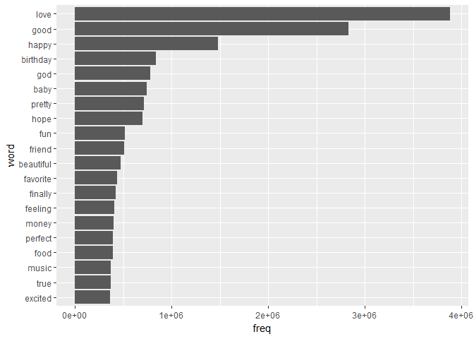
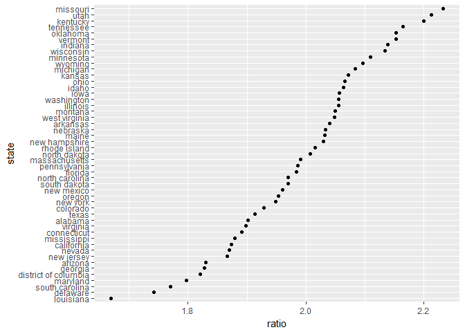

Tweets across the United States
================
Mark Blackmore
2018-01-16

-   [Sentiment lexicons](#sentiment-lexicons)
-   [Implement an inner join](#implement-an-inner-join)
-   [What are the most common sadness words?](#what-are-the-most-common-sadness-words)
-   [What are the most common joy words?](#what-are-the-most-common-joy-words)
-   [Do people in different states use different words?](#do-people-in-different-states-use-different-words)
-   [Which states have the most positive Twitter users?](#which-states-have-the-most-positive-twitter-users)
-   [Session info](#session-info)

``` r
suppressWarnings(
  suppressPackageStartupMessages({
    library(tidyverse)
    library(tidytext)
  })
)
```

### Sentiment lexicons

``` r
# Choose the bing lexicon
get_sentiments("bing") 
```

    ## # A tibble: 6,788 x 2
    ##           word sentiment
    ##          <chr>     <chr>
    ##  1     2-faced  negative
    ##  2     2-faces  negative
    ##  3          a+  positive
    ##  4    abnormal  negative
    ##  5     abolish  negative
    ##  6  abominable  negative
    ##  7  abominably  negative
    ##  8   abominate  negative
    ##  9 abomination  negative
    ## 10       abort  negative
    ## # ... with 6,778 more rows

``` r
get_sentiments("bing") %>%
  count(sentiment) # Count words by sentiment
```

    ## # A tibble: 2 x 2
    ##   sentiment     n
    ##       <chr> <int>
    ## 1  negative  4782
    ## 2  positive  2006

``` r
# Choose the nrc lexicon
get_sentiments("nrc") %>%
  count(sentiment) # Count words by sentiment
```

    ## # A tibble: 10 x 2
    ##       sentiment     n
    ##           <chr> <int>
    ##  1        anger  1247
    ##  2 anticipation   839
    ##  3      disgust  1058
    ##  4         fear  1476
    ##  5          joy   689
    ##  6     negative  3324
    ##  7     positive  2312
    ##  8      sadness  1191
    ##  9     surprise   534
    ## 10        trust  1231

### Implement an inner join

``` r
load("./data/geocoded_tweets.rda")

# geocoded_tweets has been pre-defined
geocoded_tweets
```

    ## # A tibble: 520,304 x 3
    ##      state      word         freq
    ##      <chr>     <chr>        <dbl>
    ##  1 alabama         a 16256685.699
    ##  2 alabama        a-     5491.100
    ##  3 alabama     a-day     3991.764
    ##  4 alabama        aa     4739.479
    ##  5 alabama   aaliyah     8251.955
    ##  6 alabama      aamu     4305.704
    ##  7 alabama     aaron    19813.131
    ##  8 alabama        ab    68032.127
    ##  9 alabama abandoned     4070.773
    ## 10 alabama abbeville     7153.342
    ## # ... with 520,294 more rows

``` r
# Access bing lexicon: bing
bing <- get_sentiments("bing")

# Use data frame with text data
geocoded_tweets %>%
  # With inner join, implement sentiment analysis using `bing`
  inner_join(bing)
```

    ## Joining, by = "word"

    ## # A tibble: 64,303 x 4
    ##      state           word      freq sentiment
    ##      <chr>          <chr>     <dbl>     <chr>
    ##  1 alabama          abuse  7185.962  negative
    ##  2 alabama         abused  3072.975  negative
    ##  3 alabama     accomplish  5957.113  positive
    ##  4 alabama   accomplished 13121.385  positive
    ##  5 alabama accomplishment  3035.666  positive
    ##  6 alabama       accurate 28261.680  positive
    ##  7 alabama           ache  7305.821  negative
    ##  8 alabama         aching  5079.525  negative
    ##  9 alabama         addict  5441.260  negative
    ## 10 alabama       addicted 40389.455  negative
    ## # ... with 64,293 more rows

### What are the most common sadness words?

``` r
# Access nrc lexicon: nrc
nrc <- get_sentiments("nrc")

# With inner join, implement sentiment analysis using `nrc`
tweets_nrc <- geocoded_tweets %>% 
  inner_join(nrc)
```

    ## Joining, by = "word"

``` r
tweets_nrc
```

    ## # A tibble: 210,027 x 4
    ##      state      word      freq sentiment
    ##      <chr>     <chr>     <dbl>     <chr>
    ##  1 alabama abandoned  4070.773     anger
    ##  2 alabama abandoned  4070.773      fear
    ##  3 alabama abandoned  4070.773  negative
    ##  4 alabama abandoned  4070.773   sadness
    ##  5 alabama   ability 12406.263  positive
    ##  6 alabama  abortion  3267.394   disgust
    ##  7 alabama  abortion  3267.394      fear
    ##  8 alabama  abortion  3267.394  negative
    ##  9 alabama  abortion  3267.394   sadness
    ## 10 alabama  absolute 22956.284  positive
    ## # ... with 210,017 more rows

``` r
# Most common sadness words
tweets_nrc %>%
  # Filter to only choose the words associated with sadness
  filter(sentiment == "sadness") %>%
  # Group by word
  group_by(word) %>%
  # Use the summarize verb to find the mean frequency
  summarise(freq = mean(freq)) %>%
  # Arrange to sort in order of descending frequency
  arrange(desc(freq))
```

    ## # A tibble: 585 x 2
    ##       word      freq
    ##      <chr>     <dbl>
    ##  1    hate 1253839.9
    ##  2     bad  984942.9
    ##  3   bitch  787774.0
    ##  4    hell  486259.0
    ##  5   crazy  447047.2
    ##  6 feeling  407561.6
    ##  7   leave  397805.5
    ##  8     mad  393559.5
    ##  9   music  373608.3
    ## 10    sick  362022.6
    ## # ... with 575 more rows

### What are the most common joy words?

``` r
joy_words <- tweets_nrc %>%
  # Filter to choose only words associated with joy
  filter(sentiment == "joy") %>%
  # Group by each word
  group_by(word) %>%
  # Use the summarize verb to find the mean frequency
  summarise(freq = mean(freq)) %>%
  # Arrange to sort in order of descending frequency
  arrange(desc(freq))    

# Plot the Top 20 `joy_words`
joy_words %>%
  top_n(20) %>%
  mutate(word = reorder(word, freq)) %>%
  # Use aes() to put words on the x-axis and frequency on the y-axis
  ggplot(aes(word, freq)) +
  # Make a bar chart with geom_col()
  geom_col() + 
  coord_flip() 
```

    ## Selecting by freq



### Do people in different states use different words?

``` r
tweets_nrc %>%
  # Find only the words for the state of Utah and associated with joy
  filter(state == "utah",
         sentiment == "joy") %>%
  # Arrange to sort in order of descending frequency
  arrange(desc(freq))
```

    ## # A tibble: 326 x 4
    ##    state      word      freq sentiment
    ##    <chr>     <chr>     <dbl>     <chr>
    ##  1  utah      love 4207322.0       joy
    ##  2  utah      good 3035113.5       joy
    ##  3  utah     happy 1402567.6       joy
    ##  4  utah    pretty  902946.6       joy
    ##  5  utah       fun  764045.1       joy
    ##  6  utah  birthday  663439.1       joy
    ##  7  utah beautiful  653060.9       joy
    ##  8  utah    friend  627521.5       joy
    ##  9  utah      hope  571841.1       joy
    ## 10  utah       god  536687.3       joy
    ## # ... with 316 more rows

``` r
tweets_nrc %>%
  # Find only the words for the state of Louisiana and associated with joy
  filter(state == "louisiana",
         sentiment == "joy") %>%
  # Arrange to sort in order of descending frequency
  arrange(desc(freq))
```

    ## # A tibble: 290 x 4
    ##        state     word      freq sentiment
    ##        <chr>    <chr>     <dbl>     <chr>
    ##  1 louisiana     love 3764157.0       joy
    ##  2 louisiana     good 2758698.9       joy
    ##  3 louisiana     baby 1184392.5       joy
    ##  4 louisiana    happy 1176290.6       joy
    ##  5 louisiana      god  882456.6       joy
    ##  6 louisiana birthday  740497.5       joy
    ##  7 louisiana    money  677898.6       joy
    ##  8 louisiana     hope  675559.2       joy
    ##  9 louisiana   pretty  581241.5       joy
    ## 10 louisiana  feeling  486367.3       joy
    ## # ... with 280 more rows

### Which states have the most positive Twitter users?

``` r
# With inner join, implement sentiment analysis using `nrc`
tweets_bing <- geocoded_tweets %>% 
  inner_join(bing)
```

    ## Joining, by = "word"

``` r
tweets_bing
```

    ## # A tibble: 64,303 x 4
    ##      state           word      freq sentiment
    ##      <chr>          <chr>     <dbl>     <chr>
    ##  1 alabama          abuse  7185.962  negative
    ##  2 alabama         abused  3072.975  negative
    ##  3 alabama     accomplish  5957.113  positive
    ##  4 alabama   accomplished 13121.385  positive
    ##  5 alabama accomplishment  3035.666  positive
    ##  6 alabama       accurate 28261.680  positive
    ##  7 alabama           ache  7305.821  negative
    ##  8 alabama         aching  5079.525  negative
    ##  9 alabama         addict  5441.260  negative
    ## 10 alabama       addicted 40389.455  negative
    ## # ... with 64,293 more rows

``` r
tweets_bing %>% 
  # Group by two columns: state and sentiment
  group_by(state, sentiment) %>%
  # Use summarize to calculate the mean frequency for these groups
  summarise(freq = mean(freq)) %>%
  spread(sentiment, freq) %>%
  ungroup() %>%
  # Calculate the ratio of positive to negative words
  mutate(ratio = positive / negative,
         state = reorder(state, ratio)) %>%
  # Use aes() to put state on the x-axis and ratio on the y-axis
  ggplot(aes(state, ratio)) +
  # Make a plot with points using geom_point()
  geom_point() +
  coord_flip()
```



------------------------------------------------------------------------

Session info
------------

``` r
sessionInfo()
```

    ## R version 3.4.2 (2017-09-28)
    ## Platform: x86_64-w64-mingw32/x64 (64-bit)
    ## Running under: Windows 10 x64 (build 16299)
    ## 
    ## Matrix products: default
    ## 
    ## locale:
    ## [1] LC_COLLATE=English_United States.1252 
    ## [2] LC_CTYPE=English_United States.1252   
    ## [3] LC_MONETARY=English_United States.1252
    ## [4] LC_NUMERIC=C                          
    ## [5] LC_TIME=English_United States.1252    
    ## 
    ## attached base packages:
    ## [1] stats     graphics  grDevices utils     datasets  methods   base     
    ## 
    ## other attached packages:
    ## [1] bindrcpp_0.2    tidytext_0.1.4  dplyr_0.7.4     purrr_0.2.3    
    ## [5] readr_1.1.1     tidyr_0.7.1     tibble_1.3.4    ggplot2_2.2.1  
    ## [9] tidyverse_1.1.1
    ## 
    ## loaded via a namespace (and not attached):
    ##  [1] tidyselect_0.2.2  reshape2_1.4.2    haven_1.1.0      
    ##  [4] lattice_0.20-35   colorspace_1.3-2  htmltools_0.3.6  
    ##  [7] SnowballC_0.5.1   yaml_2.1.14       rlang_0.1.2      
    ## [10] foreign_0.8-69    glue_1.1.1        modelr_0.1.1     
    ## [13] readxl_1.0.0      bindr_0.1         plyr_1.8.4       
    ## [16] stringr_1.2.0     munsell_0.4.3     gtable_0.2.0     
    ## [19] cellranger_1.1.0  rvest_0.3.2       psych_1.7.8      
    ## [22] evaluate_0.10.1   labeling_0.3      knitr_1.17       
    ## [25] forcats_0.2.0     parallel_3.4.2    broom_0.4.2      
    ## [28] tokenizers_0.1.4  Rcpp_0.12.13      scales_0.5.0     
    ## [31] backports_1.1.1   jsonlite_1.5      mnormt_1.5-5     
    ## [34] hms_0.3           digest_0.6.12     stringi_1.1.5    
    ## [37] grid_3.4.2        rprojroot_1.2     tools_3.4.2      
    ## [40] magrittr_1.5      lazyeval_0.2.0    janeaustenr_0.1.5
    ## [43] pkgconfig_2.0.1   Matrix_1.2-11     xml2_1.1.1       
    ## [46] lubridate_1.6.0   assertthat_0.2.0  rmarkdown_1.6    
    ## [49] httr_1.3.1        R6_2.2.2          nlme_3.1-131     
    ## [52] compiler_3.4.2
